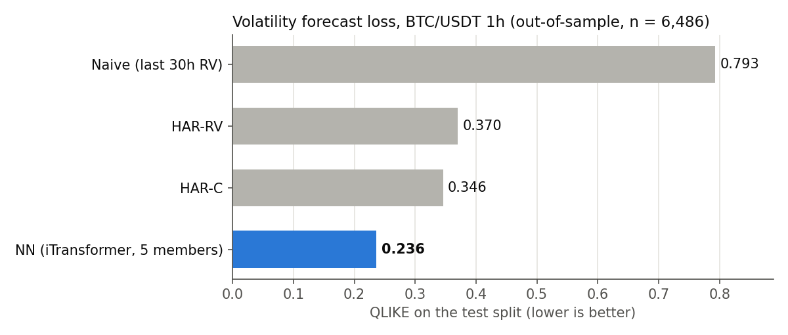
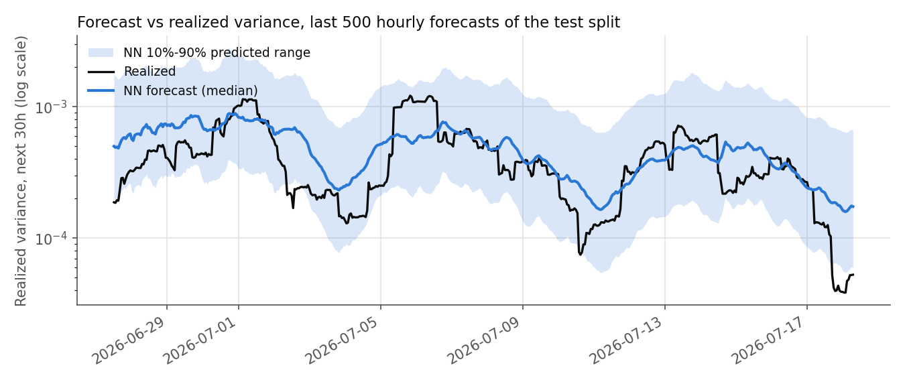

🇬🇧 English · [🇮🇹 Italiano](README.it.md)

# QUANTSYS — Neural Forecasting Engine for BTC/USDT

This project asks two questions about Bitcoin. First: can a neural network forecast how much the price will move — not in which direction, but how large the swings will be over the next 30 hours, with the forecast refreshed every hour? On data the model never saw during training, its forecasts have a lower error than the standard econometric models used as benchmarks. Second: can that forecast be turned into profit by selling volatility, that is, by collecting option premiums when the expected swings look overpriced? Not so far: the selling rules tested here failed the pass/fail criteria written down before running them.


*Forecast loss on the out-of-sample test split, one bar per model: lower is better.*


*Predicted versus realized variance of the next 30 hours on the last stretch of the out-of-sample test split, with the network's 10–90% range.*

Probabilistic neural forecasting engine for BTC/USDT + crypto-options analytics. **Production line: volatility @ 1 hour** (`config/default.yaml → features.target_type: log_rv`, `data.interval: 1h`; interval-agnostic design, 1m = identity, the 1m perimeter is backed up). The `log_rv` target is the project's **only OOS-validated signal**: it beats **HAR-C** — the HAR variant on the jump-robust continuous component alone (`C = min(RV, BV)`), i.e. the strongest econometric baseline among those tested — by **32% in test QLIKE** (0.236 vs 0.346; naive 0.793), with coherent val→test. Production model: **5-member iTransformer**. Second active arm: **short-vol** forward test on Deribit testnet (`scripts/04b_vol_paper.py`, 24/7 systemd service on a VPS). The **directional** line has no OOS alpha at any tested timeframe (1m and 1h): the code stays alive and bit-invariant as a documented negative control.

**Stack:** Python 3.12 | PyTorch (CUDA) | NumPy/Pandas | Binance REST+WebSocket | FRED API · Deribit public REST (dashboard/IV/vol forward test).

### Start here

60-second read — four pointers, most important first:

| What | Where |
|---|---|
| **The result.** The NN realized-variance forecast beats **HAR-C** (`C = min(RV, BV)`, the jump-robust continuous component — the strong baseline, not the convenient one; reference since 2026-07-31, gate C3, which replaced HAR-CJ at equal accuracy) by **32% in test QLIKE** and 23% on val (0.236 vs 0.346; naive 0.793 — Diebold-Mariano HAC significance **p ≤ 4.3·10⁻⁴**, measured against HAR-CJ, see `THEORY.md` §12.2), val→test coherent. Against plain HAR-RV the band would be −27% to −36%: the gap measures **how much of the edge came from a weak baseline**, quantified by a pre-registered gate rather than assumed. ⚠ **The 2026-06-10 pre-registered gate uses HAR-RV as its denominator, the claim uses HAR-C: two different statements, both true** — reconciliation panel at the head of `THEORY.md` §12.2 | `scripts/vol/dev_vols_qlike.py` — the judge that produces the number, val-first split |
| **How an idea lives or dies.** Every experiment is **pre-registered**: metrics, thresholds and minimum n written and committed *before* running | `THEORY.md` §12.1 (5-step protocol) · `STATUS.md` (pre-registrations on top) |
| **What was tried and does NOT work**, with numbers: directional at 1m and 1h, signed semivariance, IVS relative-value, 4 training levers, regime gating | `THEORY.md` §12.3-12.4 (KILL corpus, with numbers) |
| **What an outside reader can verify** without downloading data | `pytest tests/` → **whole suite green on CPU**, one test skipped by design: bit-perfect live↔training parity, z-score/interval invariants, incremental-regime bit-parity, pyarrow init order, regime anti-degradation guard |

The project is organized around a stated asymmetry: **even moments (variance, RV) generalize out-of-sample on this asset, odd moments (sign, skew) do not** — for the network *and* for the econometric baselines. The three code lines (vol forecasting, short-vol monetization, directional) exist to document that asymmetry, not to hide it.

### Reproducibility

`data/`, `models/` and `results/` are **gitignored**: weights and parquets are large and market data is not redistributable. What that means when you clone:

- **Verifiable immediately, no data needed:** `pip install -e .` → `pytest tests/` (CPU-only, about a minute; everything passes except one test skipped by design, whose synthetic fixture is too short for a 30-day feature; pytest prints the current count), including golden tests on the 104-feature list and live↔training parity.
- **Regenerable:** dataset (`scripts/01_download_data.py`, public Binance + a free FRED key for macro) → training (`scripts/02_train.py --n-ensemble 5`, ~27 min for 5 iTransformer seeds on an RTX 2070 Super) → QLIKE judge (`scripts/vol/dev_vols_qlike.py`).
- **NOT regenerable** (forward collection, by construction): `data/iv/`, `data/orderbook/`, `data/deribit_trades/`, `results/vol_paper/` — IV/book/trade snapshots and the testnet forward test. The short-vol arm's numbers cannot be reproduced from a clone: they are an experiment log, and are presented as such. ⚠ **2026-09-13/15 (local, not deployed):** three correctness fixes in `scripts/04b_vol_paper.py`'s adaptive executor — fill fee/timing are now treated as unknown (never invented zero) when the real trades' coverage cannot be verified, a tick's diagnostic/hedge tail is skipped instead of logging a fake "flat" snapshot when it leaves the journal blocked, and trade identity is required with concrete instrument/side persisted in the recovery record (they used to live only in the journal, cleared on verified flat); detail in `START.md` §5.3, `tests/test_adaptive_structure.py` 40/40.

### Documentation map

Documentation in **two languages, one file per language** (English `NAME.md`, Italian `NAME.it.md`, language switch on the first line). Disjoint roles — every fact lives in exactly one place:

- **[README.md](README.md)** (this file) — *what* the system does and *why*: overview, features, project structure, pointers.
- **[START.md](START.md)** — **runbook**: every operational command, detailed setup, hardware tuning, session routine, VPS deploy.
- **[THEORY.md](THEORY.md)** — **mathematics**: derivations for the loss, regime detection, Monte Carlo, distillation, trading layer.
- **[CHANGELOG.md](CHANGELOG.md)** — milestones, reverse chronological.
- **[STATUS.md](STATUS.md)** — **canonical source of truth** for state: current period + every open pre-registered gate. History predating 2026-07-08 in **[docs/STATUS_ARCHIVE_2026H1.md](docs/STATUS_ARCHIVE_2026H1.md)** (read-only).
- **[THEORY.md](THEORY.md) §12** — experimental protocol + negative-results (KILL) corpus with gate thresholds.
- **[docs/MODEL_IMPROVEMENTS.md](docs/MODEL_IMPROVEMENTS.md)** · **[docs/ROADMAP_VOL_BOOK.md](docs/ROADMAP_VOL_BOOK.md)** — backlog and open items.
- **[Architecture diagrams, live page](https://luca-feleppa.github.io/quantsys/architetture.html)** (source: [docs/architetture.html](docs/architetture.html)) — **interactive diagrams** of the architectures, derived from the `forward` passes rather than from the docs: data pipeline, iTransformer, TCN+Mamba, N-HiTS, CAFN, MoE/MoU, output head, plus the internal wiring of attention, convolution, state and decomposition. Tensor shapes update as the parameters change; IT/EN toggle inside the page.

---

## 1. Overview & Goals

Rather than a point estimate, QUANTSYS outputs the **full distribution** of the target — conditional quantiles with `loss_type: quantile` (the production default), or a parametric Student-t head μ/σ/ν with `loss_type: t_student` (§4.3) — on BTC/USDT at a **parametric candle interval** (`data.interval`; current default `1h`, legacy `1m` perimeter backed up — all temporal conversions derive from `interval_minutes`, identity at 1m). Three lines coexist on the same spine, with very different outcomes:

- **VOL line — forecasting (production, validated).** Target `log_rv` (log realized variance over h bars): the only signal that generalizes OOS, beating **HAR-C** (jump-robust continuous-component baseline) by 32% in test QLIKE. Judged via QLIKE, **never** traded in the directional backtest.
- **VOL line — monetization (forward test running).** **Short-vol** arm: Deribit-testnet straddles driven by predicted-RV vs IV (`04b_vol_paper.py`, 24/7 systemd on a VPS). The VRP edge is structurally confirmed by the FHS-GJR-GARCH historical backtest (2019→2026, n=2538), but **both pre-registered gates failed**: v1 **FAIL 0/3 (2026-07-18)** — VRP is positive, the v1 rule does not monetize it — and the v2 **delta-hedged FAIL 2/3 (2026-08-11)**, where the hedge cuts per-trade variance by **55.3%** but its realization cost (**76% perp fees**, funding <1%) exceeds the pre-registered budget by 2.6×. Gate counters still accruing in `STATUS.md`.
- **Directional line (legacy, negative control).** Target `ret`, Kelly/SL/TP trading layer, backtest and live paper. No OOS alpha at 1m or 1h; kept as a documented negative control, do not re-open it without a new hypothesis.

✅ **Live engine status (directional):** paper-only (no real orders), **BLOCKER #1 RESOLVED (2026-06-05)**. The live path builds the **104 canonical features** via `FeatureBuilder` with the training scaler, achieving **bit-perfect feature *and* signal parity** vs the backtest (`tests/test_live_training_parity.py`, replay Δ=0). ⚠ Live signals mirror a backtest that stays OOS-negative: directional paper-trading accrues forward trades, with no expectation of Sharpe>0.

### 1.1 Key Features

- **Probabilistic output** — conditional quantiles (default) or Student-t (μ, σ, ν); NLL loss + asymmetric penalty + CRPS + Direction-Value (§4.3).
- **104 engineered features** post C-funding filter, canonical list under a golden test (§3.2).
- **4 interchangeable architectures** — iTransformer, N-HiTS, TCN+Mamba, legacy LSTM — behind a single forward contract, with heterogeneous ensembling and target-aware **multi-teacher distillation** (§4.1-4.2).
- **BTC regime detection** `RegimeMarkovBTC`, causal Markov-Switching with incremental refresh (§3.3).
- **Vol-line judges** QLIKE vs a three-baseline HAR panel (RV = gate denominator, **C** = claim denominator, CJ = diagnostic) + per-fold HAR-RV in the walk-forward, val-first split (§5.1).
- **Anti-leakage validation**: purged k-fold walk-forward with embargo, backtest with stress tests, bootstrap CI, regime-conditioned analysis (§5.2).
- **Monte Carlo** 2000 GJR-GARCH(1,1) scenarios, params estimated on hourly returns (§4.4).
- **Trading layer** fractional Kelly + ATR SL + trailing + 15% MtM drawdown circuit breaker (§6.1).
- **Vol forward test** on Deribit testnet with delta-hedge, ex-post PnL attribution and **24/7 collectors** on a VPS (§6.2).
- **Dashboard** Deribit Options Risk Terminal, GPU-free, decoupled from the ML pipeline (§6.3).

---

## 2. Setup

```bash
pip install torch torchvision --index-url https://download.pytorch.org/whl/cu121
pip install -r requirements.txt
pip install -e .
python scripts/00_check_setup.py
```

`scripts/00_check_setup.py` verifies CUDA, dependencies and the Binance connection. The **CPU-only** fallback works (slower training; full speed on backtest/live). Reference setup: **RTX 2070 Super (8 GB VRAM)** — multi-seed × multi-arch training must run sequentially (OOM), and live/paper must not run alongside training/inference (CUDA contention). The FRED key is **optional**: copy `config/secrets.yaml.example` to `config/secrets.yaml` (gitignored, never committed); without a key you work under stricter rate limits.

→ **Detailed setup, PowerShell/Windows notes, VRAM tuning (4GB / ≥16GB), training timings: [START.md](START.md) §1.**

---

## 3. Data

The pipeline downloads BTC/USDT history from Binance (default: **1h** candles from 2019-01-01, ~65k bars), engineers **104 features**, normalizes them with a **global RobustScaler** (median/IQR, fit on training ONLY — no val/test leakage), and windows into **120×104** sequences (`model.window_size: 120` = 5 days at 1h; `window_stride: 1`). Temporal 80/10/10 split (`training.val_fraction`/`test_fraction` = 0.1/0.1 → ~6.5k windows each for val and test on the current dataset). Scaler params + feature config + `target_scale` + `forecast_horizon` + `interval` are persisted in `PipelineState` (the single train↔inference contract).

### 3.1 Target & log-return

Everything works on **log-returns** (stationary, symmetric), never absolute prices. The horizon is **30 bars** (`features.forecast_horizon: 30` — 30h at 1h). Changing it requires regenerating the dataset and re-aligning `PipelineState.forecast_horizon` (validated at runtime with `RuntimeError` in backtest and live). Target families via `features.target_type`: `log_rv` (vol production: log realized variance Σr² over h bars), `ret` (legacy directional: sum of future log-returns), `log_rs_ratio` (semivariance asymmetry probe, FAIL — §7).

### 3.2 The 104 features

**104 features = 86 dynamic + 18 structural**: VWAP + Volume Profile, CVD, candle microstructure, funding rate, multi-window volatility, lag returns, time encoding, feature interactions, structural levels. The **C-funding filter** (`LIVE_DROP_FEATURES` in `quantsys/features/__init__.py`) drops 15 features — long-lookback (90d/365d), fractionally differenced, or long-Volume-Profile dependent — for two cumulable reasons: permutation importance with ROI ≤ 0 (noise or harmful) and/or a lookback not computable in the live buffer. Keeping them breaks live↔backtest parity with no predictive gain. The list is derived once by `canonical_feature_columns` under a golden test: the count is **verified on the dataset, not assumed**. Family-by-family detail in [THEORY.md](THEORY.md) §3.

### 3.3 Macro & regime detection

US macros (FRED + yFinance: DXY, VIX, rates, gold) feed a `MacroEncoder` (16-dim), decoupled from the regime detector. **`RegimeMarkovBTC`** (Markov-Switching, Hamilton 1989) is fit on hourly BTC realized volatility and is **CAUSAL by design**: *filtered* probabilities (never smoothed), forward-only Hamilton filter, expanding walk-forward with burn-in/retrain from `macro.hmm_burn_in_days`/`hmm_retrain_days`. It yields **3 data-driven regimes** persisted in `data/regime_probs.parquet` (hourly UTC index); on the 2026-07-15 seven-year 1h full rebuild: **R0 31% (quiet, σ²≈0.12) · R1 36% (stress, σ²≈4.8) · R2 33% (mid, σ²≈0.6)**. ⚠ The **indices carry no fixed semantics across runs**: re-derive them from the variances at every full rebuild. An **incremental** refresh is available (`01b --regime-incremental`): it appends only the new bars from a walk-forward checkpoint, with test-enforced bit-parity. Use: **val stratification + per-regime `val_nll` diagnostics** — **NOT an input feature**. `RegimeMarkovSwitching` (US-macro daily), `RegimeHMM` and `RegimeSession` (Asia/EU/US) remain optional alternatives. Full derivation in [THEORY.md](THEORY.md) §4.

### 3.4 z-score vs raw invariant

⚠ **The project's costliest bug.** The model predicts μ/σ/ν in **z-score space** (target scaled by the RobustScaler; `target_scale` = raw-target IQR, persisted in `PipelineState`); the trading layer (`SignalGenerator`, `RiskManager`) operates in **raw space**. **Every entry-point MUST call `PipelineState.denormalize_predictions(mu, sigma)` right after the forward**, before the trading layer (bug 2026-05-23: skipping it → macroscopic SL/TP, Sharpe −256 → +18.7). With the `log_rv` target, `denormalize_predictions` alone is **insufficient** (log-RV median ≈ −7.2): the full inversion is `μ·IQR + center` from the persisted RobustScaler. Derivation in [THEORY.md](THEORY.md) §5.

---

## 4. Modeling

### 4.1 Architectures

Four architectures selectable via `--arch`, behind a single forward contract:

- **iTransformer** (`QuantiTransformer`) — attention over features (not time), multi-scale embedding, O(F²). **Production arch of the vol line (5 members).**
- **N-HiTS** (`QuantNHiTS`) — pure-MLP hierarchical interpolation, multi-scale pooling stacks (8/4/1).
- **TCN+Mamba** (`QuantTCNMamba`) — dilated causal convolutions (receptive field 127) + State Space Model with input-dependent parameters and gated fusion.
- **LSTM+GRU** (`QuantLSTM`) — dual-stream with temporal attention (legacy, backward compat; under-performing).

**Forward contract:** `forward(x, x_macro=None) -> (mu, ls2, lnu)` (`+dir_logits` if multitask; `(quantile_preds, ...)` if `loss_type=quantile`, the default). Arch-isolated output paths: `models/{arch}/` and `results/{arch}/`.

⚠ **On-disk state vs code capability.** The **heterogeneous ensemble** (combining different archs at inference via the Law of Total Variance — `mu_ens = Σ wᵢ·muᵢ`, `sigma_ens = sqrt(Σ wᵢ·σᵢ² + Σ wᵢ·(muᵢ−mu_ens)²)`, weights in `DEFAULT_ARCH_WEIGHTS` or dynamic inverse-NLL) is implemented and alive, but **the production vol line runs on iTransformer only**: `models/nhits` and `models/tcnmamba` were removed in the 2026-06-12 cleanup and **must be retrained before any heterogeneous run**. **AMP off at inference** (avoids spectral_norm + Mamba-scan NaN). Composition single source of truth: `config/default.yaml → distillation.archs`. ⚠ On the directional line the cross-arch error is ≈0.995 → the variance reduction from ensembling is ≈0.

### 4.2 Multi-teacher Knowledge Distillation

An alternative to the homogeneous 5×-same-arch ensemble: all architectures in `distillation.archs` are trained, given a **target-aware score** (`teacher_score_weights`, single source of truth in `distillation.py`) — for the directional `ret` target val_loss, Spearman ρ and directional accuracy all weigh in; for the **volatility** target `log_rv` directional accuracy weighs **0** (on variance it is sign-vs-median, not a tradable signal: the straddle is direction-neutral) — and each model is then distilled as a **student** on soft labels μ/ls²/lnu formed as a weighted average of *all* teachers, with output-head transfer and a scale-normalized mixed loss. The point is that the aggregation implicitly excludes overfit archs instead of blindly averaging them. Weight formulas, softmax temperature and the student loss in [THEORY.md](THEORY.md) §7; commands and examples in [START.md](START.md) §3.5.

### 4.3 Loss & probabilistic output

Each prediction is a **full conditional distribution**, not a point estimate — the predicted σ is what feeds both position sizing and the vol line's RV-vs-IV comparison. `loss_type` (`config/default.yaml → model`) selects **two mutually exclusive branches**:

- **`quantile` — production default.** Pinball loss over 5 levels `[0.1, 0.25, 0.5, 0.75, 0.9]`; `model(x)` returns `(quantile_preds, dir_logits)` and `model.predict(x)` derives **μ = q(0.5)** (conditional median) and **σ = q(0.9) − q(0.1)** (interdecile range, **not** a standard deviation). Effective objective: `0.7 · pinball + 0.3 · CE` from the multitask directional head.
- **`t_student`.** Student-t NLL (heavy tails, crypto is not Gaussian) + an **asymmetric penalty** on sign errors beyond a magnitude threshold + **CRPS** (calibration of the whole distribution, not just the mean) + a **Direction-Value joint loss** (couples sign to value).

⚠ The three additive terms of the second branch are **inert** on the production one despite holding non-zero config values (`asymmetry_alpha`, `crps_weight`, `dv_lambda`) — per-branch table of active terms, the pinball definition and the μ/σ misreading traps in [THEORY.md](THEORY.md) §7.0. Output lives in **z-score space** and must be denormalized upstream of the trading layer (§3.4). Closed forms, gradients and weight rationale in [THEORY.md](THEORY.md) §7.

### 4.4 Monte Carlo simulation

2000 scenarios × 30 bars with **GJR-GARCH(1,1)** volatility (`config/default.yaml → montecarlo`). Params **re-estimated on hourly returns** on 2026-07-15 (Gaussian QMLE + variance targeting over ~65k bars 2019→2026): `ω=1.026e-6, α=0.1011, γ=0.0052, β=0.8732` → persistence 0.977, 30h half-life, **γ≈0.005: near-zero leverage effect at 1h**. Parametric per-bar σ cap (`gjr_sigma_cap: 0.13` at 1h); the 1m-era values stay in `config/interval/1m.yaml` for rollback. MC is **not on the backtest critical path** (which uses model μ/σ, not GARCH). Derivation in [THEORY.md](THEORY.md) §8.

---

## 5. Evaluation

### 5.1 VOL-line judges

Primary metric: **QLIKE** (robust volatility loss) + NN/baseline ratio; reference baseline **HAR-C** since 2026-07-31 (gate C3, replacing the HAR-CJ adopted by C2 on 2026-07-30: same accuracy, 450× better conditioning), with HAR-RV and HAR-CJ reported alongside as context. ⚠ The pre-registered 2026-06-10 **gate** keeps **HAR-RV** as its denominator: the claim uses HAR-C, the gate does not — the judge prints each number's role. Vol models are **never traded in the backtest**: judging is purely predictive. Judges in `scripts/vol/`: `dev_vols_qlike.py` (log-RV QLIKE, main judge), `dev_vols_rs_judge.py` (semivariance asymmetry), `wf_har_baseline.py` (per-fold HAR), `step0_xarch_corr.py` (cross-arch correlation kill-check), `mfiv_comparator_judge.py` (MFIV@30h vs ATM IV comparator on the forward test). **Val-first** split via `QUANTSYS_VOLS_SPLIT=val|test`; shared logic (QLIKE, log-RV inversion, HAR) lives in `quantsys/model/vol_metrics.py`. **Key result:** the PASS **as registered** (2026-06-10) is NN-log_rv 0.257 QLIKE vs HAR-RV 0.368 vs naive 0.807 on the 1h test split (−30%); the **current claim**, against HAR-C and on a model/scaler pair retrained on the current npz, is 0.236 vs 0.346 (**−31.65%**; on val −22.42%). ⚠ The two decimals identify the (model, npz, config) triple producing the number, they are **not** a confidence interval: measured uncertainty is ~±0.7 points with respect to the training config, zero with respect to the seed. Since 2026-08-04 that pair is a **permanent, re-judgeable artifact** (`models/canonical_1h_vols/`, gate R1, gitignored like all of `models/`): `python scripts/vol/dev_vols_qlike.py --arch canonical_1h_vols` reproduces its number, with the scaler identity guard required to print `IDENTICO`.

### 5.2 Walk-forward & backtest

**Walk-forward** purged k-fold with anti-leakage embargo (`scripts/02b_walkforward_validate.py`): the embargo (`embargo_steps=168`, 1 week at 1h) is sized ≥ `window_size+horizon` because windows and targets overlap in time — without it the test fold sees data already seen in training. Fold mechanics in [THEORY.md](THEORY.md) §7bis. **Directional backtest** (`scripts/03_backtest.py`): fee model + sqrt-impact slippage, stress tests (pessimistic and flash-crash), 5000-iter bootstrap CI, regime-conditioned analysis, MDD recovery. Trading thresholds in `config/default.yaml → backtest` live in **RAW space** — do not override them from `arch/*.yaml` without recalibrating.

⚠ **val→test distribution shift — it belongs to the TARGET, not the pipeline.** On the **directional** line in-sample metrics (val_nll, Spearman/WHR walkforward) **anti-correlate** with the backtest: do not optimize rules driven by in-sample metrics. On the **`log_rv`** target val→test are instead **coherent** (verified by the 2026-06-10 PASS) → the vol line's val-first gates are informative. ⚠ Methodological corollary: a lever must always be judged against a **baseline retrained on the same dataset/scaler**, never against the production incumbent — cross-scaler comparisons produce artifacts (§7).

### 5.3 Tests

```bash
pytest tests/                          # full suite
pytest tests/test_recent_fixes.py -v   # regression on critical fixes (z-score, RevIN, BLOCKER #1)
```

The suite targets the **invariants that fail silently when broken**: `FeatureBuilder` no-leakage, scaler invariants, the `PipelineState` contract, live↔training parity, incremental-regime bit-parity, the 104-list golden. After any fix impacting shape/scaler/features: add a regression test and re-align the golden snapshots.

---

## 6. Deploy & Inference

```bash
python run_all.py     # interactive menu
```

→ **All commands (per-phase pipeline, per-arch training, walk-forward, backtest, live, collectors, session routine, VPS deploy): [START.md](START.md).**

### 6.1 Directional inference chain

Chain: forward → `PipelineState.denormalize_predictions(μ, σ)` (z-score → raw) → conviction score (direction × magnitude × calibration × regime) → **Risk Manager** (fractional Kelly ∝ edge ∝ 1/variance, max 1%/trade; ATR SL 3×; trailing; 15% MtM intra-trade drawdown circuit breaker) → BUY/SELL/HOLD + size + SL + TP. Production live path: `LiveCandleBuffer`(50k) → `FeatureAssembler` → `FeatureBuilder.build(fit=False)` (104 canonical, scaler from `PipelineState`) → `LiveEngine._deterministic_predict` (deterministic core shared with the backtest) → `denormalize_predictions` → `SignalGenerator`. Binance WebSocket feed with exponential-backoff reconnect, state persistence, incremental Volume Profile, thread-safe funding refresh. ⚠ This is the **legacy line with no OOS alpha**: it runs as a negative control, not as a strategy.

⚠ The path carries a set of **deliberate fail-fast guards** (raw-σ cap, `forecast_horizon` and `interval` train-vs-inference validation, `merge_asof` alignment, stop floor, atomic checkpoints): they exist to catch denormalization and train↔inference contract bugs and **must not be removed**. Itemized list in [THEORY.md](THEORY.md) §12.5.

### 6.2 Vol forward test & 24/7 collectors

The **short-vol** arm (`scripts/04b_vol_paper.py`) compares model-predicted RV against Deribit implied vol and opens straddles on the **Deribit testnet** when the edge exceeds the pre-registered threshold, with a perp **delta-hedge** leg. It runs as a **24/7 systemd service on a VPS** (the home PC is passive: launching `04b` locally would double up orders on the same testnet position). Always-long/always-short-vol comparison baselines in `04c_vol_paper_baselines.py`; ex-post delta/gamma/theta/vega PnL attribution in `scripts/vol/pnl_attribution.py`. **Pre-registered v1 gate: FAIL 0/3 (2026-07-18)** — positive VRP confirmed, the v1 rule does not monetize it. **V2 delta-hedged gate: FAIL 2/3 (2026-08-11)** over n=20 hedge-active settlements — the variance reduction is real and large (`var(hedged)/var(unhedged) = 0.447`, i.e. −55.3% against the required −40%), but the mean drag is −0.647·SE against a −0.25·SE budget and is **76% rebalancing fees** and **0.9% funding**: the hedge buys variance and pays for it, so the perp leg is disabled and the production design remains the unhedged v1. Other gates are accruing sample (state and counters in `STATUS.md`).

Three **forward collectors** run in parallel on the same VPS and produce the project's only **non-regenerable** data: `01c_iv_poller.py` (Deribit option chain + DVOL → `data/iv/`), `01d_orderbook_recorder.py` (Binance L2 order book, microstructure → `data/orderbook/`), `01e_trades_recorder.py` (Deribit options trades for realized spreads → `data/deribit_trades/`; API retention is ~24h, so collection is necessarily forward). Deploy kit in `deploy/vps/`, home-side sync in `scripts/vps/`.

### 6.3 Dashboard — Deribit Options Risk Terminal

`scripts/06_dashboard.py` is a crypto-options analytics terminal: single-file HTTP server + Plotly SPA, **GPU-free and decoupled from the ML pipeline**, fed by **Deribit public** data (REST, no-auth). It computes Greeks in real time over the whole option chain (Black-Scholes forward measure, r=0) and exposes four views: Volatility Surface, Option Chain, Risk & Greeks, and **Trades** (settled history + open position of the `04b` forward test). Launch: `python run_all.py --only-dashboard` → `http://localhost:8050`. View details, endpoints and configuration: [START.md](START.md) §5.4.

---

## 7. Experimental outcomes

Every experiment follows a pre-registered protocol (gates written BEFORE running, val-first validation, levers as inert-by-default flags) and **every negative outcome is kept**: kill-records are documental, the "vaccine against involuntary re-testing". The synthesis of years of gates is sharp: the **vol line** is the project's only OOS PASS (`log_rv` beats HAR-RV by 30% in QLIKE, coherent val→test), whereas the **directional line has no OOS alpha at any tested timeframe** — at 1m the wall is transaction cost, at 1h the cost falls away but no skill emerges; neither regime gating, nor threshold/rank entries, nor σ recalibration produce OOS PnL. The cross-cutting prior that follows: **even moments (variance, RV) generalize OOS, odd ones (sign, signed asymmetry) do not**.

**Where to read what:** [CHANGELOG.md](CHANGELOG.md) for milestones in chronological order · [STATUS.md](STATUS.md) for the canonical source (current period + every open gate, with the decisional numbers) · [docs/STATUS_ARCHIVE_2026H1.md](docs/STATUS_ARCHIVE_2026H1.md) for history predating 2026-07-08 (literal split-off, read-only) · [THEORY.md](THEORY.md) §12 for the experimental protocol, the KILL corpus with numbers and the inert flags not to be re-tested.

---

## 8. System Architecture

```
Binance REST/WS
      │
      ▼
OHLCV candles 1h (default: 2019-01-01 → today, ~65k bars)
      │
      ▼
Feature Engineering: 104 features (VWAP, VP short/mid, CVD, microstructure,
                                   funding, time, lag, interactions)
      │
      ├─── Macro data (FRED + yFinance) → MacroEncoder 16-dim
      ├─── BTC → hourly realized vol → RegimeMarkovBTC (Markov-Switching, 3
      │                                data-driven regimes — semantics re-derived per run)
      │
      ▼
Sliding windows 120×104 (context 120 bars = 5 days at 1h) → normalized dataset (RobustScaler)
      │
      ▼
Architecture (selectable):
      │
      ├─ itransformer → attention over features, multi-scale   [vol-line production, 5 members]
      ├─ nhits        → hierarchical pure-MLP (stacks 8/4/1)   [to be retrained]
      ├─ tcnmamba     → dilated TCN (RF=127) + Mamba SSM       [to be retrained]
      ├─ lstm         → LSTM+GRU dual-stream + attention (legacy)
      │
      ├─ [--distill]  Multi-teacher Knowledge Distillation: target-aware scoring →
      │                weighted soft labels (shuffle-safe) → student at 60% epochs
      │
      ▼
Output: μ + σ + ν   in z-score space
      │
      ▼
PipelineState.denormalize_predictions(μ, σ)   →   raw space
      │
      ├──────────────────────────────► VOL LINE (production)
      │                                 QLIKE judging vs HAR-RV  ·  04b: RV_pred vs IV
      │                                 → short-vol straddle on Deribit testnet + delta-hedge
      ▼
DIRECTIONAL LINE (legacy, negative control)
      │
      ├─ Monte Carlo: 2000 GJR-GARCH(1,1) scenarios × 30 bars (off critical path)
      ├─ Conviction score (direction × magnitude × calibration × regime)
      ├─ Risk Manager (Kelly sizing, ATR stop, trailing, 15% MtM circuit breaker)
      ▼
BUY / SELL / HOLD  +  size  +  stop loss  +  take profit
```

### 8.1 Project Structure

```
quantsys_project/
├── config/
│   ├── default.yaml              shared parameters (data, features, model, training, risk, distillation)
│   ├── secrets.yaml.example      API-key template (copy to secrets.yaml, gitignored)
│   ├── interval/                 candle-resolution overrides (1m.yaml legacy · 1h.yaml current)
│   ├── arch/                     per-architecture overrides (lstm, itransformer, nhits, tcnmamba, regime-MoE)
│   └── cafn.yaml                 optional CAFN overlay (probe, not read by the production pipeline)
├── quantsys/                     installable Python package (pip install -e .)
│   ├── data/                     Binance REST + WebSocket + funding · deribit.py (public client + delivery cache)
│   ├── features/                 FeatureBuilder (104 features post C-funding, canonical_feature_columns, dual-stream)
│   ├── macro/                    FRED + yFinance · RegimeMarkovBTC + fallback · MacroEncoder / MacroNormalizer
│   ├── model/
│   │   ├── __init__.py           QuantLSTM, QuantiTransformer, QuantTFT
│   │   ├── nhits.py              QuantNHiTS (hierarchical pure-MLP)
│   │   ├── tcn_mamba.py          QuantTCNMamba (TCN + Mamba SSM + gated fusion)
│   │   ├── ensemble.py           EnsembleModel (homogeneous / heterogeneous, AMP off at inference)
│   │   ├── distillation.py       multi-teacher Knowledge Distillation (target-aware scoring)
│   │   ├── forecast.py           Monte Carlo GJR-GARCH(1,1) + neural-guided
│   │   ├── vol_metrics.py        QLIKE / log-RV inversion / HAR-RV, HAR-C, HAR-CJ baselines
│   │   │                         + Diebold-Mariano HAC and Duan smearing (vol line, shared)
│   │   ├── vol_forecaster.py     VolForecaster (vol-paper forecast core, promoted from 04b) + macro_snapshot (instrument vs state: legacy refit or pinned normalizer)
│   │   ├── regime_gate.py        build_regime_gate (causal gate: backward asof + staleness bound)
│   │   ├── cafn.py               CausalAttentionFlowNetwork (causal coordinator, inert probe)
│   │   └── revin.py              Reversible Instance Normalization (optional, use_revin)
│   ├── trading/                  Kelly sizing, dynamic SL, trailing, circuit breaker
│   │                             + greeks_risk.py (vega/delta cap, vega-loss CB, margin sim — not wired to live)
│   └── utils/                    config loader, device setup, logging, PipelineState, atomic_save, stats
├── scripts/                      numbered spine (phase) + per-line subfolders — map: scripts/README.md
│   ├── 00_check_setup.py         checks CUDA, dependencies, Binance connection
│   ├── 01_download_data.py       Binance → 104 features → npz dataset  ·  01_update_data.py (delta; --candles-only = OHLCV only)
│   ├── 01b_download_macro.py     FRED + yFinance → RegimeMarkovBTC (full / --regime-incremental)
│   ├── 01c/01d/01e_*.py          24/7 forward collectors: Deribit IV · Binance L2 order book · options trades
│   ├── 02_train.py               training with --arch / --distill / ensemble  ·  02b walk-forward  ·  02c optuna  ·  02d CAFN
│   ├── 03_backtest.py            directional backtest + stress test + bootstrap CI
│   ├── 04_live_signals.py        live WebSocket feed + paper trading (directional, legacy)
│   ├── 04b_vol_paper.py          vol forward test: RV_pred vs IV → Deribit testnet straddle (+ delta-hedge)
│   ├── 04c_vol_paper_baselines.py  always-long / always-short-vol baselines for the pre-registered gates
│   ├── 05_analyze_signals.py     live session analysis  ·  07_verify_teacher.py  architecture comparison
│   ├── 06_dashboard.py           Deribit Options Risk Terminal (single-file HTTP + Plotly)
│   ├── 99_replay_live_vs_training.py   diagnostic replay of live vs training parity
│   ├── vol/                      vol line: QLIKE/RS/MFIV judges, data prep, per-fold HAR, cross-arch
│   │                             kill-check, short-vol (historical backtest + arm), IVS, PnL attribution
│   ├── research/                 paper material / directional negative control
│   ├── vps/                      home-side sync of the VPS collectors (scp pull + dedup merge + heartbeat)
│   └── archive/                  closed probes (cross-sectional KILL, σ-recal)
├── deploy/vps/                   24/7 collector kit (geo-test, one-shot setup, systemd units)
├── tests/                        pytest suite (features, NLL, PipelineState, parity, regime, greeks, regression)
├── avvio_sessione.ps1            home-side session routine (VPS pull + regime freshness + vol monitoring)
├── run_all.py                    orchestrator: data → macro → train → walkfwd → backtest → live → dashboard
├── README.md · START.md · THEORY.md · CHANGELOG.md · STATUS.md
├── docs/                         MODEL_IMPROVEMENTS · ROADMAP_VOL_BOOK · STATUS_ARCHIVE_2026H1 · paper/
├── data/                         generated (gitignored) — ⚠ data/iv, data/orderbook, data/deribit_trades NOT regenerable
├── models/                       per-architecture checkpoints (gitignored)
├── results/                      per-architecture backtests, judges and live signals (gitignored)
└── logs/                         rotating logs (gitignored)
```

See [START.md](START.md) for the full operational guide and [THEORY.md](THEORY.md) for theoretical foundations.

---

## License

[MIT License](LICENSE) — research code, **not financial advice**.

**Disclaimer.** This repository is a personal research project. No line executes orders with real capital: the directional arm is **paper-only** and the short-vol arm runs on **Deribit testnet** (paper funds). Published metrics are out-of-sample where stated and come from pre-registered gates — including the **failures**, reported with the same numbers as the successes. Nothing here is investment advice or a return expectation; trading crypto derivatives carries a risk of total loss. Market data belongs to the respective venues (Binance, Deribit) and is not redistributed in this repo.
